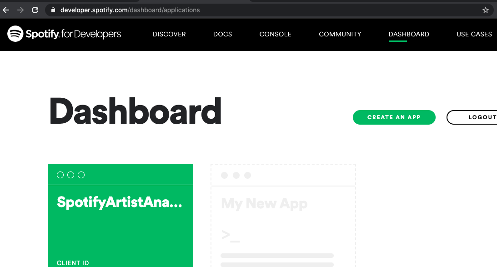

# Spotify Data Analysis

### Read this before you start:

Make/login to the developer account on Spotify. https://developer.spotify.com/dashboard/login

After logging-in, you will be redirected to the SpotifyforDevelopers. From the Menu, click on Dashboard as shown below. 

 

After clicking on the Dashboard, click on Create-App as shown below. 

 

Fill in the App name and the App description then click on Create. After this you will be redirected to the place where you will get the Client ID and Client Secret ID as shown below. 

 

And there you go! Easily you can get the client id and client secret id! 

Moreover, you can also add Redirect URIs by going to Edit Settings as shown below. 

 

Now, to get the username of your Spotify account, click here: https://www.spotify.com/us/account/overview/

After this, click on Profile --> Account as shown below.

 

After this you will be redirected to the Account overview and as shown below, you can get your username. 

 
